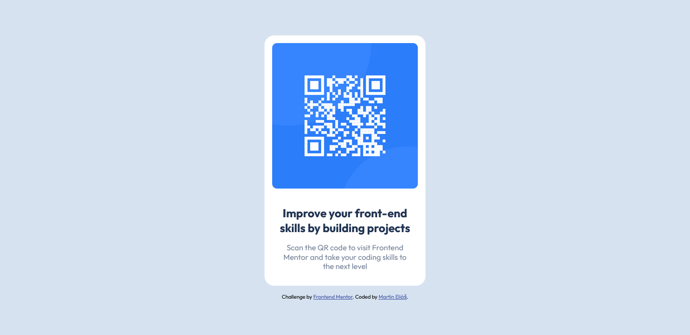

# Frontend Mentor - QR code component solution

This is a solution to the [QR code component challenge on Frontend Mentor](https://www.frontendmentor.io/challenges/qr-code-component-iux_sIO_H). Frontend Mentor challenges help you improve your coding skills by building realistic projects. 

## Table of contents

- [Overview](#overview)
  - [Screenshot](#screenshot)
  - [Links](#links)
- [My process](#my-process)
  - [Built with](#built-with)
  - [What I learned](#what-i-learned)
  - [Continued development](#continued-development)
- [Author](#author)

## Overview

### Screenshot

### Links

- Solution URL: [https://www.frontendmentor.io/solutions/responsive-qr-card-using-sass-flexbox-paHrwmOZ2](https://www.frontendmentor.io/solutions/responsive-qr-card-using-sass-flexbox-paHrwmOZ2)
- Live Site URL: [https://qr-code-component-main-dun.vercel.app/](https://qr-code-component-main-dun.vercel.app/)

## My process

### Built with

- Semantic HTML5 markup
- Flexbox
- Mobile-first workflow
- [Sass](https://sass-lang.com/) - Css preprocessor

### What I learned

I learned how to use Sass on a project with basic variables.

### Continued development

I´ll continue to master Sass functions, mixins, etc...

## Author

- LinkedIn - [Martin Eliáš](https://www.linkedin.com/in/martin-eli%C3%A1%C5%A1-455550209/)
- Frontend Mentor - [@smradupan](https://www.frontendmentor.io/profile/martinelias1312)
